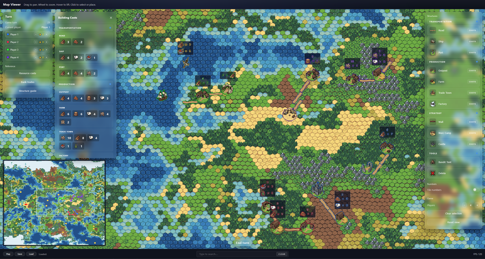
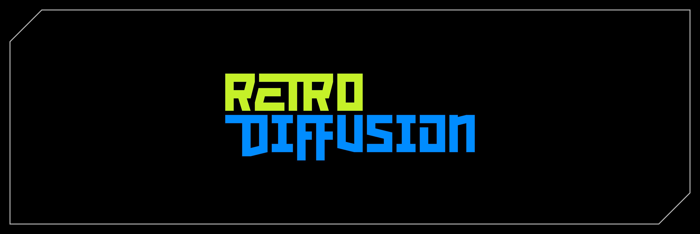

# Hex Map Game

> [!WARNING]
> **WORK IN PROGRESS**: This project is currently not balanced, fully tested, or final.

## What this is
A digital map for a hexagon tile-based 2-10 player resource management and exploration game, featuring several quality-of-life improvements to streamline gameplay.

## What it is not
This is **not** a fully online game. It is designed to be played with a group of friends in person, using physical dice and cards/tokens to track resources.

---

## Features
- **Full Game Map**: Detailed tiles for resources and roll values.
- **Structures**: Build for production, travel, and defense.
- **Turn Management**: Player tracking with roll reminders and resource calculations.
- **References**: Integrated building costs, bank trades, and structure guides.
- **Minimap**: Quick navigation and overview.
- **Search**: Locate structures, resources, roll numbers, or players via the minimap search bar.
- **Tooling**: Map creation, loading, and saving (including turn-based autosaves).

---

## Getting Started

### Prerequisites
- Ensure **Python** is installed and accessible from your command prompt.

### How to Run
1. Run `run.bat`.
2. This script will automatically:
    - Install necessary Python libraries for the map generator.
    - Launch the web server on your local network.
3. Access the webpage from any machine on your **local network**.

---

## Rules (Simplified)

- **Setup**:
    - Each player starts with one **Outpost**, one **Farm**, and one **Road**.
    - Roll for turn order.
    - Place an Outpost + Road in turn order.
    - Place a Farm + Road in turn order.
    - Use the **Skip** button to advance turns without rolling during setup.
- **Construction**:
    - Structures must be built adjacent to another structure you own.
    - *Note: Walls and ships do not count for adjacency expansion.*
- **Expansion**:
    - **Ports** can be built adjacent to ships, allowing your territory to expand across water to new land.
- **Winning**:
    - There is currently no defined winning condition.

---

## Project Status
- All rules, costs, and mechanics are subject to change based on playtesting feedback.
- This project is strictly **non-commercial** for the time being.

---

## Credits

All art assets used in this project were created using [RetroDiffusion](https://www.retrodiffusion.ai/).
